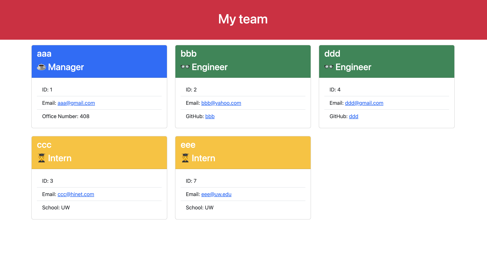
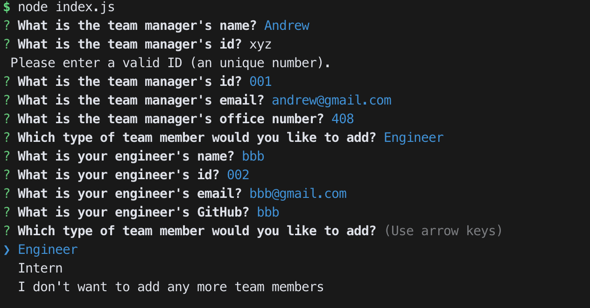

# Andrew's Team Profile Generator

## 🔎 Overview:
> * Automatically generate team webpage based on the prompted input
>
> * Use "npm i" to install dependencies. Then use "node index" to run the application
>
> * Using inquirer@8.2.4 & built-in fs package
>
> * Generated webpage will be located at dist folder and will be called index.html
>
> * OOP De-couple Code Pattern

> **Note**: Basic validations have been implemented. Only lib folder has been unit-tested.
>


## 🎬 Tutorial Video URL:
❗❗❗ ☛ [Clik Me To The Page!](https://drive.google.com/file/d/1YGLhAfYM7MCMeEJbgjtinuhXynmXpmbZ/view) ☚ ❗❗❗
```
https://drive.google.com/file/d/1YGLhAfYM7MCMeEJbgjtinuhXynmXpmbZ/view

(If the link is not working, please see the tutorial gif at the next section.)
```

## 📷 Screenshots Of The Applications:

||
|:--:| 
| *Sample of the generated webpage* |

||
|:--:| 
| *Prompted questions* |

||
|:--:| 
| *Short tutorial* |
- - -
© 2023 edX Boot Camps LLC. Confidential and Proprietary. All Rights Reserved.
